# YANG Suite core Django application.

Capable of dynamic discovery of installed application plugins. Provides common library APIs for logging, filesystem access, GUI appearance and behavior, and client-server communication.

Authors: Members of the Cisco YANG Suite development team.
Supports: Python 3.6, Python 3.7, Python 3.8
YANG Suite can be installed as a Docker container or through Python package management. Docker-compose is the recommended install.

Requires about 3.5GB of memory to load large Cisco native models.

Refer to this page for the YANG Suite installation guidance https://github.com/CiscoDevNet/yangsuite

Background

IOS XE Release: 17.3


## Module Topics:

Introduction to NETCONF/YANG

Enable NETCONF/YANG

YANGSuite

Conclusion


## Introduction to NETCONF/YANG

In this section we will look at YANG data models, why we need them, and how to find them. We will use a tool called YangSuite to find the data models we need, and we will write Python scripts using the models.

## Login Information

### Enable NETCONF/YANG

Before we start using YANG Suite to look at the data models on our switches, we need to run through a few steps to enable NETCONF, which is not on by default.

Open a SSH session to your C9300 switch and Verify AAA and NETCONF are already configured on the device.

```
C9300#sh run | sec aaa

aaa new-model

aaa authentication login default local

aaa authorization exec default local

aaa session-id common

C9300#sh run | sec vty

line vty 0 4

exec-timeout 0 0

 length 0

transport input all

line vty 5 15

exec-timeout 0 0

length 0

transport input all

C9300#sh run | i netconf

netconf-yang

C9300#show run | i username

username admin privilege 15 secret 9 ....

```

# YANGSuite

YANG Suite is a tool developed by Cisco to help you visualize YANG data models downloaded from a device, to test sending and receiving data to/from devices using YANG models, as well as a NETCONF RPC Builder Application to experiment with YANG Data Models.

At the beginning of this lab we already have verified AAA and NETCONF on the switch that have been already configured on the device.

> Access the POD# that you have been assigned to.

* Open a Firefox web browser and access YANG Suite at **http://10.1.1.3:8480/**

* Login using the provided credentials **(admin/Cisco123)**

Once logged in, you'll end up at the mail YANG Suite application window:

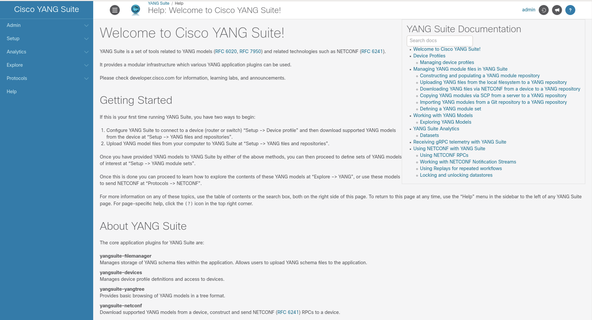

YANG Suite allows you to work with different YANG Modules repositories. This is very useful especially if working with different device releases at the same time.

### Step 1: Configure YANG Suite to connect to a device

#### Configure the device profile in Cisco YANG Suite

Navigate to **"Setup" -> "Device Profiles"** and click on **"Create new device"**

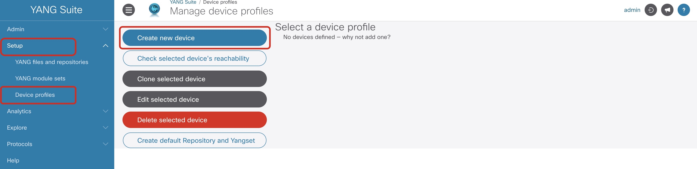

In the pop up window type in the following information as shown below

```
Profile Name: C9300

Address: 10.1.1.5

Username: admin

Password: Cisco123
```


*Note: Make sure to select **"Device support NETCONF"** and **"Skip SSH key validation for this device"** since the device doesn't have a consistent SSH key.*


Click on **"Create Profile"** when finished


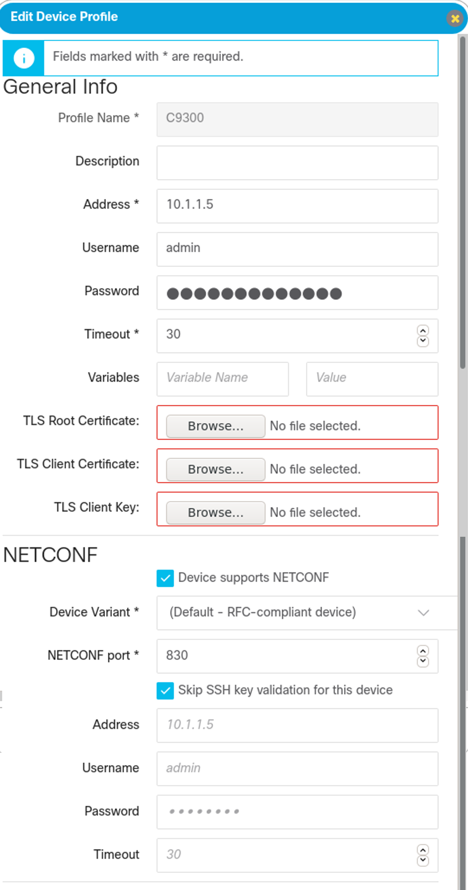

Once you have entered the information, you can click the **"Check selected device's reachability"** button.

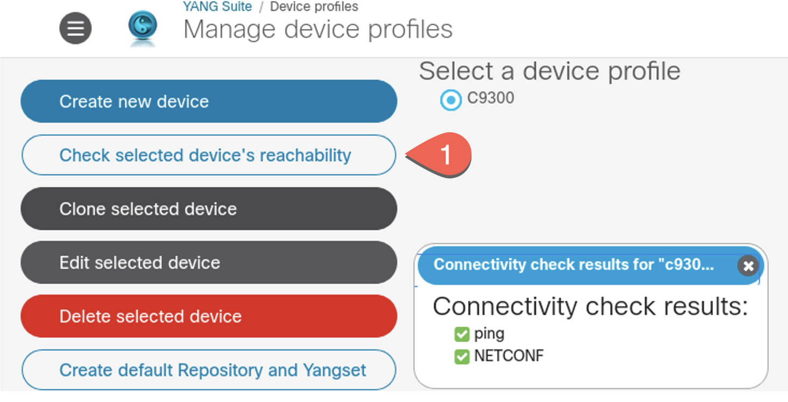

### Step 2: Download YANG models from the device

#### Create a new YANG module Repository

From the menu at the left side of the page select **"Setup"** > **"YANG files and repositories"**.

* Click on **"New repository"**.

* Enter the new repository name **"IOS XE Switching"**.

* Click on **"Create repository"**.

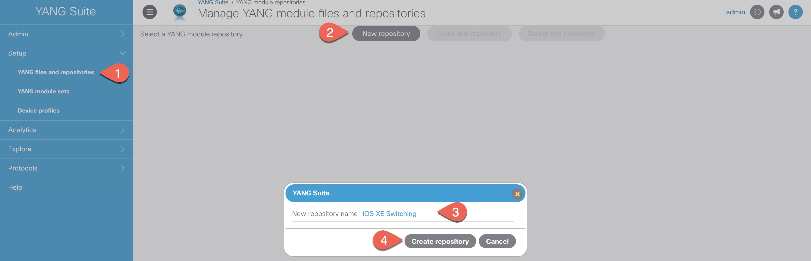

The newly created repository is automatically selected from the **"Select a YANG module repository"**

We are going to download the whole schema list from the device to our newly added repository.

* Navigate to the **"NETCONF"** tab

* Select device profile from the drop-down **“C9300”**.
* Click on **"Get schema list"** > **"Select all"** > **"Download selected schemas"**.

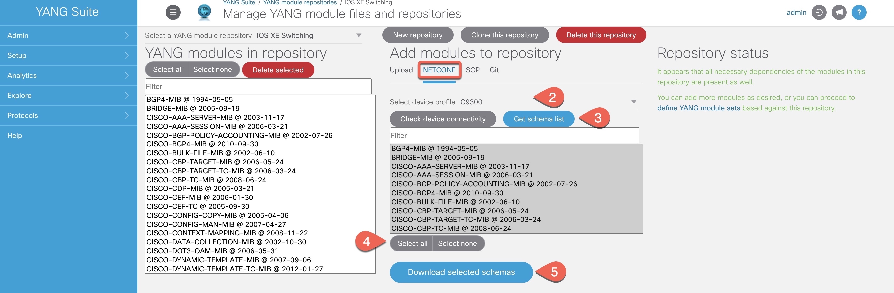

#### Create a YANG module Set

Next, you will create a YANG model set. A YANG set is a subset of a YANG repository, consisting of a set of modules of interest and any necessary dependencies they have. A YANG set could be as large as the entire repository's contents, but it's often more efficient to narrow the set down to only the models that we're really interested in.

From the menu at the left side of the page select **"Setup"** > **"YANG module sets"**

* Click on **"New YANG set"**.

* Type in name for new YANG set **“IOS XE Switching – Cisco Native”**.
* Click on **"Create YANG set"**.

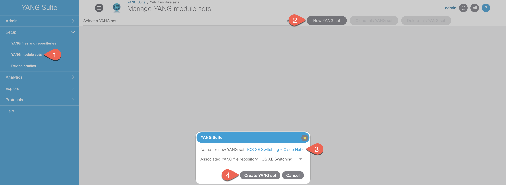

Now we will add YANG Modules to the newly created set.

* Click on **"Add entire repository"**

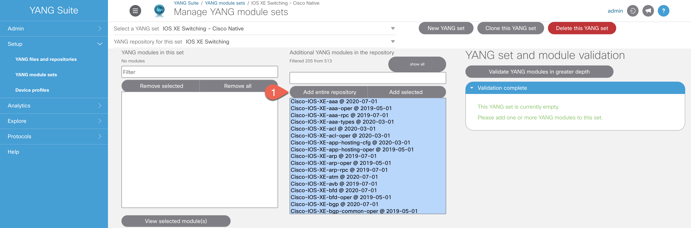

*Note: It might take some time to dowload the whole repository!*

YANG Suite automatically runs a validation check to make sure all the modules dependencies are met and provides an automatic remediation in case some dependencies are missing.
All the IOS XE Native modes are displayed in the box on the left.

### Step 3: Explore YANG Models

Now that we have a YANG model repository and have identified a YANG model subset of interest, let's explore the data model. From the menu at the left side of the page, select **"Explore" > "YANG"**.

* Click on the **"Explore"** menu and then **"YANG"** on the left pane
* Select **"IOS XE Switching – Cisco Native"** from the **"Select a YANG set"** drop down menu.
* Type **“interface”** in the **"Select YANG modules(s)"** box and select the **“Cisco-IOS-XE-interfaces-oper”** module.
* Click on the **"Load module(s)"** button and expand the **“Cisco-IOS-XE-interfaces-oper”** module by clicking on the triangle on the left.
Refer to the screenshot to examine the structure of the model and its content


After a moment, the left column will be populated with a tree view of the contents of this module. Initially the tree view shows only the module itself, but you can click the triangle icon next to it to expand the tree.

Go ahead and expand various parts of the tree:

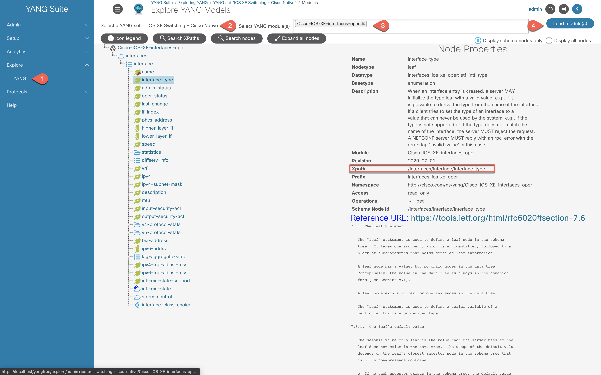

Two important pieces of YANG model metadata are the **Xpath** and the **Prefix**. These fields are used with Model Driven Telemetry to retrieve information with. If a telemetry subscription was to be created based on the IOS XE interfaces YANG data model, the **Xpath** of **“/interfaces/interface/interface-type”** and **“interfaces-ios-xe-oper”** would be used to retrieve and publish information from those models.

### Step 4: Build and send NETCONF messages

YANG Suite allows you to interact with the devices using most of the programmatic
interfaces: NETCONF, RESTCONF, gNMI, and gRPC. This step uses the NETCONF
programmatic interface:
Using a NETCONF get-config RPC to modify device configuration

* Click on the **"Protocols"** menu and then **"NETCONF"** on the left pane

* Select **"IOS XE Switching – Cisco Native"** module set from the **"Select a YANG set"** drop-down menu
* Type **"ietf-Interface"** in the Module(s) box, select the **"ietf-Interfaces"** module
* Select the **"C9300"** from the drop-down list
* Click on the **"Load Module(s)"** button

We just want to get all configuration data about the Loopback interface on our device, so expand the YANG tree and click in the **"Value"** column next to the interfaces container to add a value – **“Loopback0”**

*Note: Make sure not to put a space between "Loopback" and "0"!*

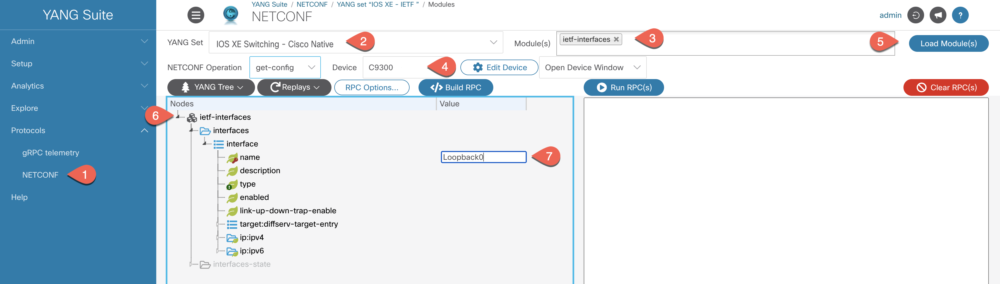

Click **"Build RPC"** and the corresponding NETCONF RPC will be constructed for you.


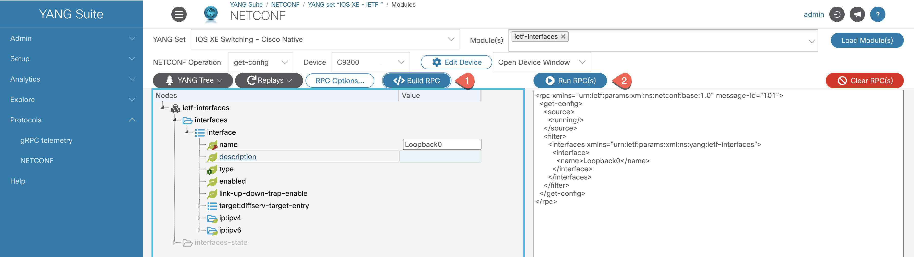

Now click **"Run RPC(s)"**, and a new window will open showing the NETCONF session to the device, including your RPC being sent and the reply from the device describing the current interface configuration.

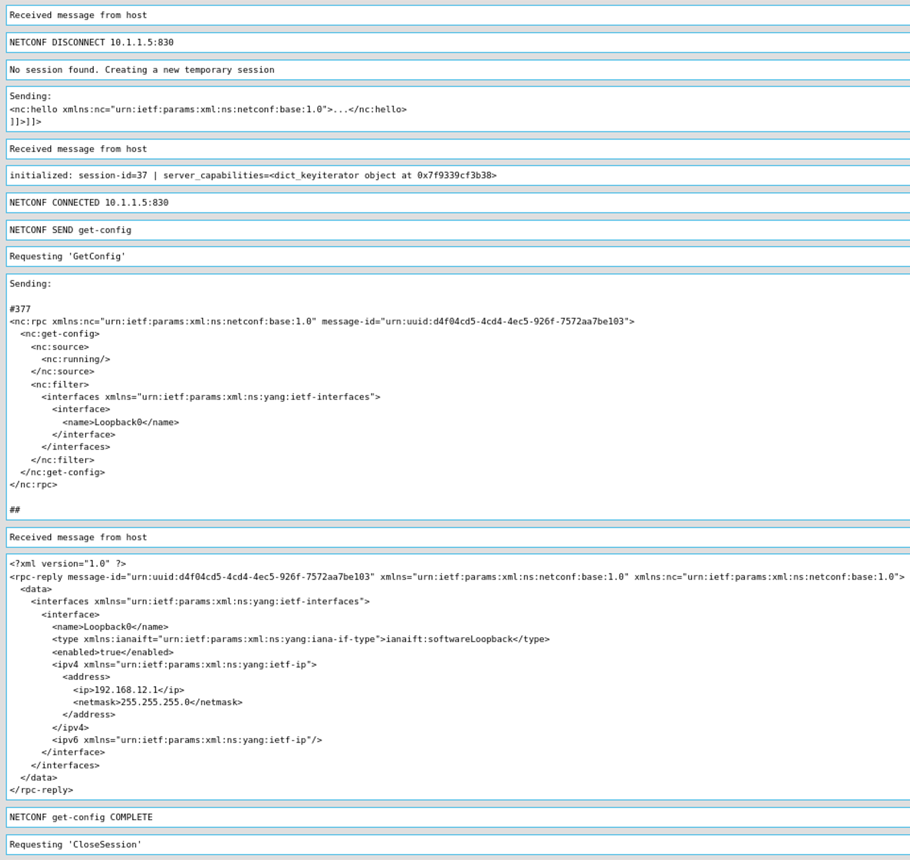

Just like that, you've built and sent a **NETCONF RPC!**


#### Using a NETCONF <span style="color:#B73650; background-color:#F8F2F4;">edit-config</span> RPC to modify device configuration

Inspecting the configuration is a good start, but we want to actually change the configuration - making our mark.

First, click on the YANG Tree drop down and select **“Clear Values and Operation”**.

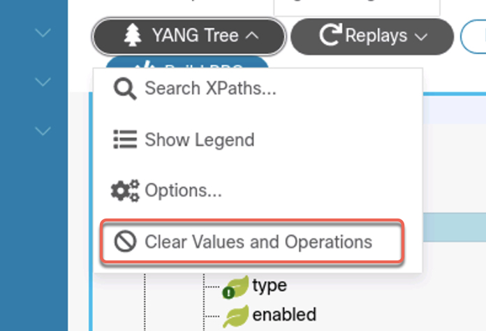

Then click the **"Clear RPCs"** button to erase the RPC we just ran, as we don't need it right now. Then, switch the NETCONF operation to <span style="color:#B73650; font-weight:bold; background-color:#F8F2F4;">edit-config</span>.

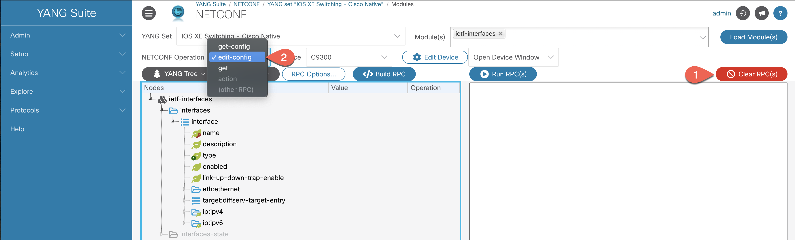


We're going to set the description on the **Loopback interface** to show that we were here.

Expand the <span style="color:#B73650; font-weight:bold; background-color:#F8F2F4;">interfaces</span> container in the tree view so that the <span style="color:#B73650; font-weight:bold; background-color:#F8F2F4;">description</span> leaf is now visible.

* Click on the **"Value"** column next to the <span style="color:#B73650; font-weight:bold; background-color:#F8F2F4;">name</span> leaf, and enter **"Loopback0"**.

* Click on the **"Value"** column next to the <span style="color:#B73650; font-weight:bold; background-color:#F8F2F4;">description</span> leaf, and enter a suitable message like **“Cisco Live 2021”**.
* Click on the **"Operation"** column next to the <span style="color:#B73650; font-weight:bold; background-color:#F8F2F4;">description</span> leaf, and select <span style="color:#B73650; font-weight:bold; background-color:#F8F2F4;">replace</span>.
Click **"Build RPC"** to construct your <span style="color:#B73650; font-weight:bold; background-color:#F8F2F4;">edit-config</span> RPC.

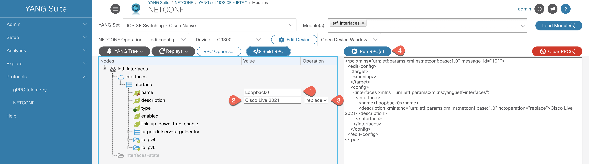

Now click **"Run RPC(s)"** again, and a new window will open showing the **NETCONF** session to the device.

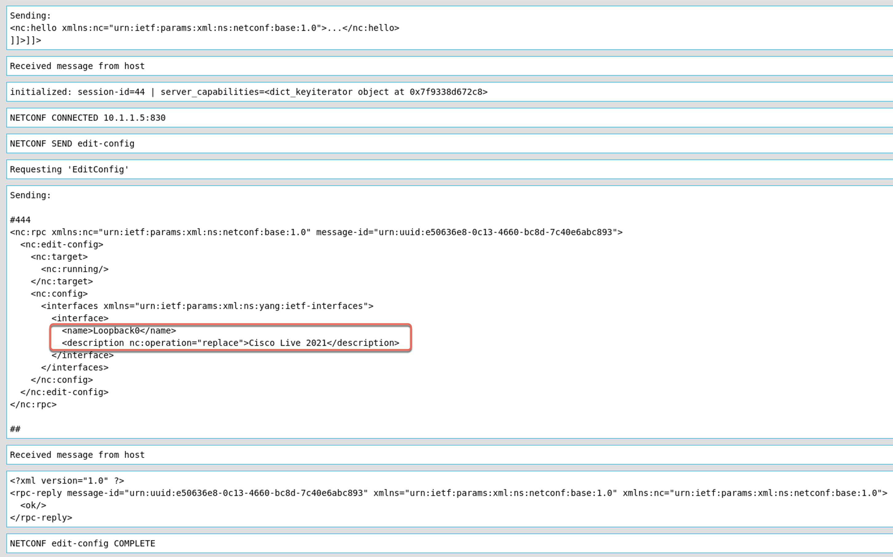

Next, let's add a targeted <span style="color:#B73650; font-weight:bold; background-color:#F8F2F4;">get-config</span> RPC to check that our configuration change actually took effect.

First, click the **"Clear RPCs"** and **"Clear Values and Operations"** buttons to erase the RPC we just ran, as we don't need it right now.


Then change the NETCONF Operation to <span style="color:#B73650; font-weight:bold; background-color:#F8F2F4;">get-config</span>, make sure the <span style="color:#B73650; font-weight:bold; background-color:#F8F2F4;">running</span> datastore is selected, and enter **"Loopback0"** value as the leaf name to get-config operation.

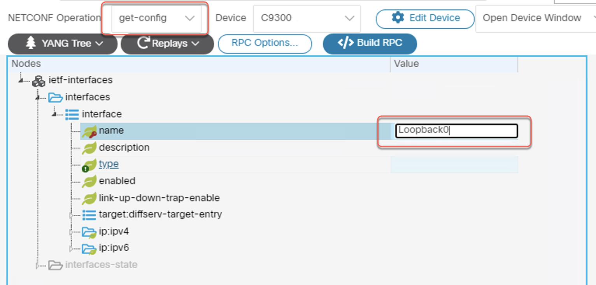


Perform the same steps as before. Click **"Build RPC"** and **“Run RPC”**.

You will see each RPC and its corresponding response. If all goes well, you will see that your configuration change has taken effect!


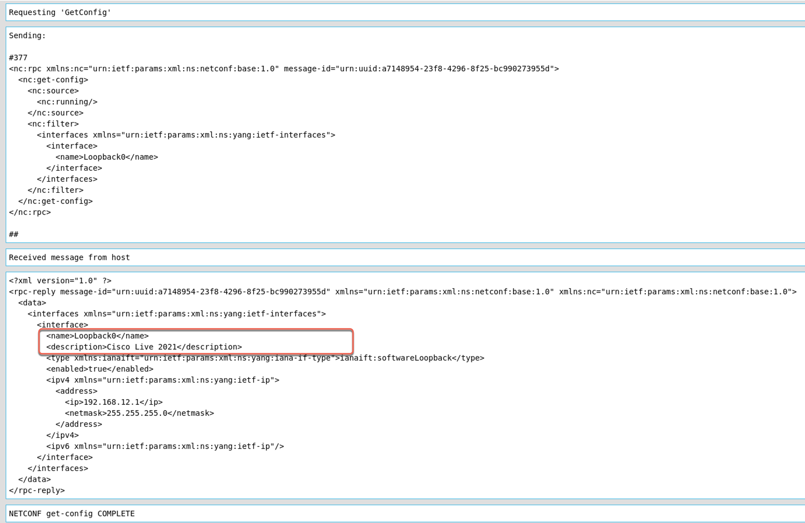

Just like that, you've built and confirmed the <span style="color:#B73650; font-weight:bold; background-color:#F8F2F4;">edit-config</span> **NETCONF** RPC operation!

## Conclusion

In this module the **YANG Suite** tooling was introduced and used to explore the **NETCONF** programmatic interfaces as well as to understand details of the associated with the **YANG data models**.

You have learned how to Launch and connect to **YANG Suite**. How to configure **YANG Suite** to connect to a router or switch. How to download **YANG models** from a device using **NETCONF**. How to explore and navigate the **YANG models** using the **YANG Suite GUI** and how to Construct simple **NETCONF** messages and transmit them to a device using the **YANG Suite GUI**.
